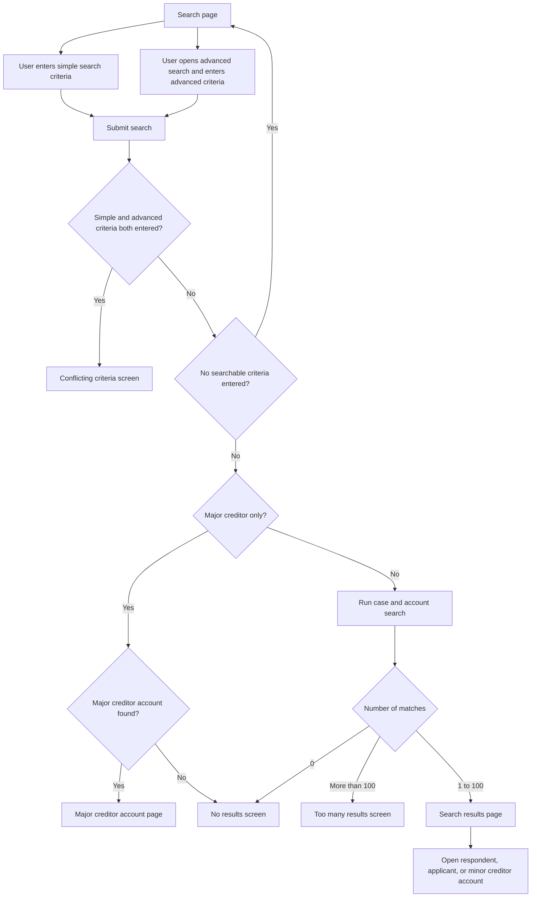

# Search flows and logic

This page documents the Search journey in the prototype for functional specification work. It covers the user flows, search criteria, matching rules, result handling, and prototype-specific notes for simple search and advanced search.

## Scope

The Search journey lets a user find cases and accounts, then open the relevant respondent, applicant, minor creditor, or major creditor account.

Search is available from `/search` and is shown as the active Search item in the service navigation.

The current prototype uses in-memory prototype data. It does not call a backend, database, or external search service.

## Screen Flow

## Search Page

The main search page is titled "Search for cases and accounts".

Simple search is shown first. Advanced search is hidden in a GOV.UK details component labelled "or use advanced search". Advanced search uses tabs for:

- Respondents
- Applicants
- Minor creditors
- Major creditors

There is also an "Active accounts only" checkbox in the advanced search section. It is checked by default in the interface.

## Simple Search

### Visible criteria

The visible simple search field is:

| Field | Purpose |
| --- | --- |
| Account number | Find a case by respondent, applicant, minor creditor, or major creditor account number. |

### Supported server-side criteria

The route also supports a `reference-number` field, although that field is not currently visible on the search page template. The conflict screen describes this as "a reference or case number".

If the reference number field is posted, it searches against:

- REMO reference
- case reference

### Simple search matching rules

Account number search:

- must match an account number exactly after normalising spaces and hyphens
- checks respondent account numbers, applicant account numbers, minor creditor account numbers, and major creditor account numbers
- uses account prefixes generated by the prototype:
  - `RP` for respondent accounts
  - `AP` for applicant accounts
  - `MC` for minor creditor accounts
  - `MA` for major creditor accounts

Reference number search:

- matches against the REMO reference or case reference
- is case-insensitive
- ignores spaces and hyphens
- supports partial matching

## Advanced Search

Advanced search lets the user search using respondent, applicant, minor creditor, or major creditor details.

### Respondent fields

| Field | Matching rule |
| --- | --- |
| Last name | Case-insensitive partial match |
| First names | Case-insensitive partial match |
| Date of birth | Exact date match after normalisation |
| Postal or zip code | Partial compact match, ignoring spaces and hyphens |

### Applicant fields

| Field | Matching rule |
| --- | --- |
| Last name | Case-insensitive partial match |
| First names | Case-insensitive partial match |
| Date of birth | Exact date match after normalisation |
| Postal or zip code | Partial compact match, ignoring spaces and hyphens |

### Minor creditor fields

The minor creditor tab has a radio choice for "Individual" or "Company".

Individual fields:

| Field | Matching rule |
| --- | --- |
| Last name | Case-insensitive partial match |
| First names | Case-insensitive partial match |
| Postal or zip code | Partial compact match, ignoring spaces and hyphens |

Company fields:

| Field | Matching rule |
| --- | --- |
| Company name | Case-insensitive partial match |
| Postal or zip code | Partial compact match, ignoring spaces and hyphens |

For a minor creditor search, the case must have at least one minor creditor that matches all the minor creditor criteria entered.

### Major creditor field

The major creditor tab uses an autocomplete control with central authority options, for example "Central Authority - Australia".

If a major creditor is the only advanced search criterion:

- the prototype looks for a major creditor account with that major creditor code
- if found, the user is taken directly to the major creditor account page
- if not found, the user is taken to the no results screen

If a major creditor is combined with other advanced search criteria:

- it acts as another filter
- the case must match the other advanced criteria and have a major creditor account with the selected major creditor code

## Combining Criteria

The user must search using either simple search criteria or advanced search criteria, not both.

If the user enters both:

- an account number or reference number, and
- any respondent, applicant, minor creditor, or major creditor field

they are shown the conflicting criteria screen.

Within advanced search, criteria are combined using "and" logic:

- if respondent fields are entered, all entered respondent fields must match
- if applicant fields are entered, all entered applicant fields must match
- if minor creditor fields are entered, one minor creditor on the case must match all entered minor creditor fields
- if a major creditor is selected with other criteria, the case must also have that major creditor
- if "Active accounts only" is selected, the case status must be `Active`

The active accounts checkbox does not count as a searchable criterion on its own. If it is the only selected option and no search fields are entered, the user is returned to the search page.

## Normalisation Rules

Before matching, the prototype normalises some values:

| Value type | Normalisation |
| --- | --- |
| General text | Trimmed and converted to lowercase |
| Compact text, such as account numbers and postcodes | Trimmed, lowercased, and spaces and hyphens removed |
| Dates | Normalised to `DD/MM/YYYY` where possible |

Accepted date formats include:

- `YYYY-MM-DD`
- `D/M/YYYY` or `DD/MM/YYYY`
- written dates such as `15 March 1975`

Dates must match exactly after normalisation.

## Results

If the search returns no matches, the user is shown the no results screen.

If the search returns more than 100 matches, the user is shown the too many results screen and asked to narrow the search.

If the search returns between 1 and 100 matches:

- the matching rows are stored in session data
- the user is redirected to the search results page
- the results table shows:
  - respondent account
  - applicant account
  - minor creditor accounts
  - status
  - arrears
- respondent, applicant, and minor creditor account numbers are links to their account pages
- if there are more than 25 results, MOJ pagination is shown
- each results page shows 25 results

## Error And Exception Screens

| Scenario | Destination | User-facing message |
| --- | --- | --- |
| Simple and advanced criteria are both entered | `/search/conflicting-criteria` | "You cannot search using a quick search field and advanced search fields at the same time" |
| No matching results | `/search/no-results` | "There are no matching results." |
| More than 100 matching results | `/search/too-many-results` | "There are more than 100 results. Narrow your search to see fewer results." |
| No criteria entered | `/search` | The user is returned to the search page. |

## Prototype Data Notes

Search runs against the compact `searchData` list in `app/routes.js`. That data is also used to populate respondent and creditor account records for the account pages.

The current prototype data includes:

- respondent accounts
- applicant accounts
- minor creditor accounts
- one major creditor account for `Central Authority - Australia`

The minor creditor company search path exists in the route logic, but the current compact search data contains individual minor creditor records rather than company minor creditor records. Unless company minor creditor data is added, company searches are likely to return no results.

The route reads address line 1 fields for respondent, applicant, and minor creditor searches, but those address line 1 fields are not currently displayed on the search page. The visible address-related fields are postal or zip code fields.

## Implementation References

- Search page template: `app/views/search/index.html`
- Search results template: `app/views/search/results.html`
- Search exception templates: `app/views/search/conflicting-criteria.html`, `app/views/search/no-results.html`, `app/views/search/too-many-results.html`
- Search route and matching logic: `app/routes.js`, search section from `// -- Search`
- Major creditor autocomplete options: `majorCreditorOptions` in `app/routes.js`
- Major creditor prototype account data: `majorCreditorAccounts` in `app/routes.js`
